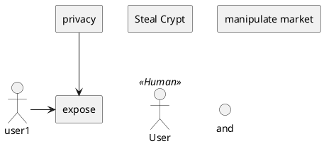
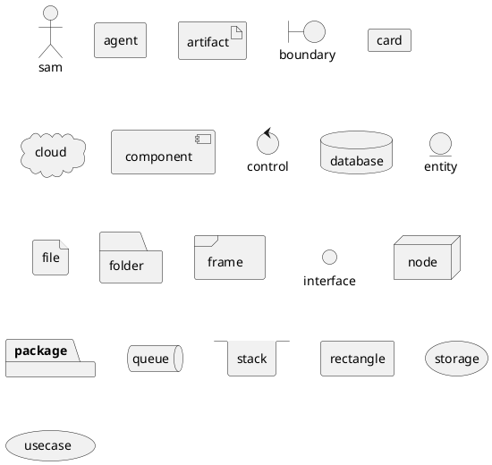

# Threatmodel

```plantuml
@startuml
skinparam monochrome true
skinparam defaultTextAlignment center 
agent "Steal Crypt" as steal 
agent "manipulate market" as market
agent "privacy" as privacy

agent "expose" as spy 
User << Human >>
user1 -> spy
privacy --> spy

interface "and" as and 
@enduml
```

```plantuml
@startuml
skinparam monochrome true
skinparam defaultTextAlignment center 

actor sam
agent agent
artifact artifact
boundary boundary
card card
cloud cloud
component component
control control
database database
entity entity
file file
folder folder
frame frame
interface  interface
node node
package package
queue queue
stack stack
rectangle rectangle
storage storage
usecase usecase
@enduml
```
